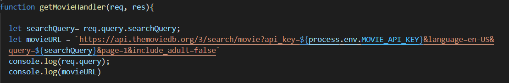
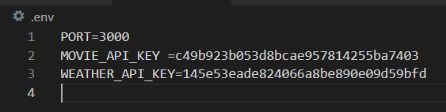
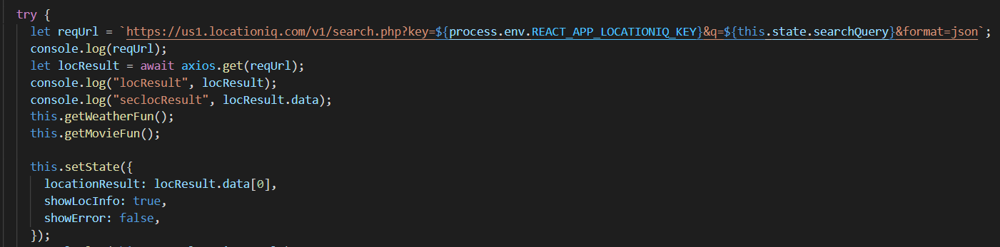
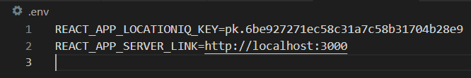

## I used different APIs in my city explorer and I'll talk about some of them :

**1. Movie DB API :**

**API Description :** The API service is for developers that want to use our movie, TV show, or actor photos and/or data in their apps. Our API is a system that allows you and your team to retrieve and use our data and/or photos programmatically.
I used The Movie Database (TMDB) API version 3 A current list of the available methods on our movie, television, actor, and image API can be seen below.

**API Usage :** This API will return lists of movies 
You'll start by running a query through one of the movie, TV show, or person search techniques. For this example, we'll use Jack Reacher and the movie method:
```
https://api.themoviedb.org/3/search/movie?api_key={api_key}&query=Jack+Reacher
```
This will return a several fields, one of which is the results field, which you should examine. Our usual movie list objects will be stored in this array. As an illustration of the first thing, consider the following:
```
{
  "poster_path": "/IfB9hy4JH1eH6HEfIgIGORXi5h.jpg",
  "adult": false,
  "overview": "Jack Reacher must uncover the truth behind a major government conspiracy in order to clear his name. On the run as a fugitive from the law, Reacher uncovers a potential secret from his past that could change his life forever.",
  "release_date": "2016-10-19",
  "genre_ids": [
    53,
    28,
    80,
    18,
    9648
  ],
```
**API Endpoints/Request URLs :**

Three bits of information are required to create an image URL. The base url, size, and file path are all variables, so I used searchQuery for the following cities: Amman, Paris and Seattle. Simply put, you'll get a completely qualified URL if you mix them all. As an example, here's a URL:
```
https://image.tmdb.org/t/p/w500/8uO0gUM8aNqYLs1OsTBQiXu0fEv.jpg
```
here is a request URL for the movies: 


**API Authentication Key :** 

- Authentication of the application : On version 3, application-level authentication is controlled by api key, a single query parameter, or by using your v4 access token as a Bearer token. Log in to your TMDB account and click the "API" link on the left hand sidebar of your account page to request an API key.

API Key : Once you've been given a key, make the following request (changing the api key>> text with your own API key):
```
https://api.themoviedb.org/3/movie/76341?api_key=<<api_key>>
```
Every method has a "Try it out" tab throughout this documentation. This feature allows you to paste your API key (along with any other relevant parameters) and make a live call to the API.

here is the key I used:


Movies:


**2. LocationIQ API:** 

**API Description :** 
LocationIQ offers enterprise-grade location-based solutions that are flexible. Every day, we collaborate with developers, startups, and businesses all across the world to serve billions of requests.

**API Usage :**
 This API will return for us the location 

Request can be sent to that endpoint:
```
curl --request GET \
  --url 'https://us1.locationiq.com/v1/search.php?key=YOUR_ACCESS_TOKEN&q=Empire%20State%20Building&format=json'
  ```
  
  

**API Endpoints/Request URLs :**

In city expolrer I used this URL : `https://us1.locationiq.com/v1/search.php?key=${process.env.REACT_APP_LOCATIONIQ_KEY}&q=${this.state.searchQuery}&format=json` and this is a request URL that has a variable like Query and key so the Query will return to us cities.

**Authentication Key :**

An access token is required for any request to LocationIQ's APIs or Map tiles. 
- Access Tokens: We propose that you generate fresh access tokens on your User Dashboard for user-facing applications like Javascript webpages or mobile apps. To prevent misuse, create a distinct access token for each application, title it appropriately (e.g. "my website"), and reissue it frequently. Access tokens can be used in both public and private environments (websites and apps) (server backends).

 
