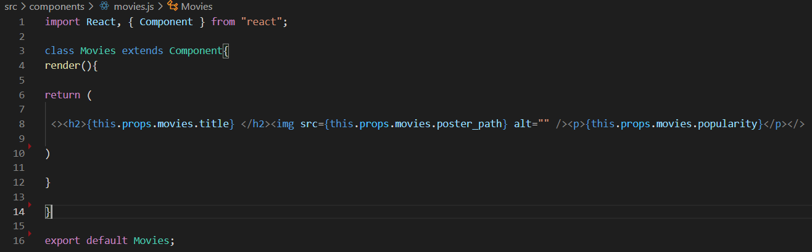
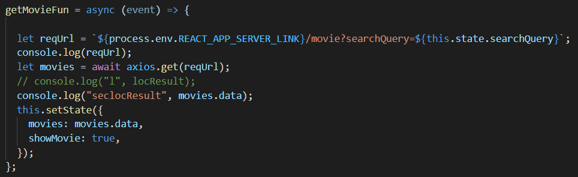

**What is Black box testing ?**

Black box testing is a software testing process that involves testing software without understanding the code or program's internal structure. Testers are the ones that perform this type of testing. Higher degrees of testing, such as System Testing and Acceptance Testing, are relevant.

**What is White box testing ?**

White box testing is a software testing method in which the internal structure of the software is known to the tester who will be evaluating it. Typically, software engineers perform this type of testing. Testing is used in the lowest levels of testing, such as Unit and Integration testing.

- This function will retrieve the data about the current weather as you will see there will be a request URL for the weather and I took that URL from weatherBit :
so when the user press on explore button it will appear for him the data (response data)

So the data will be return as below for 16 days with description :

- I created movie function for getMovieHandler that will make a request to retrieve a data for list of movies so if the user search about the folloeing cities: Amman, Paris and Seattle the data will be calling as the search Query,:

I will show you list of movies results  :

- This fuction is refers to how the URL or End Point will response to the request :

- In my code "Front End" I created component for movies and weather to Modularize: 

A look for the funstion I have used for the movies and weather:

 
- I used location API in my code from LocationIQ, this fuction will return tittle, latitude and longitude So when the user press on expllore button it will show him a result for the city map and data of the city:

